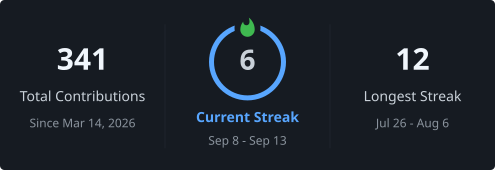

<!-- Dark · modern · professional GitHub profile — thnam02 -->
<!-- Stats are live from your GitHub account via github-readme-stats -->

  

 

---
## Tech Stack

**Languages**

**Frontend**

**Backend**

**AI / ML / Computer Vision**

**Databases**

---

## GitHub Stats

<!-- Live data from your public GitHub activity -->

 

